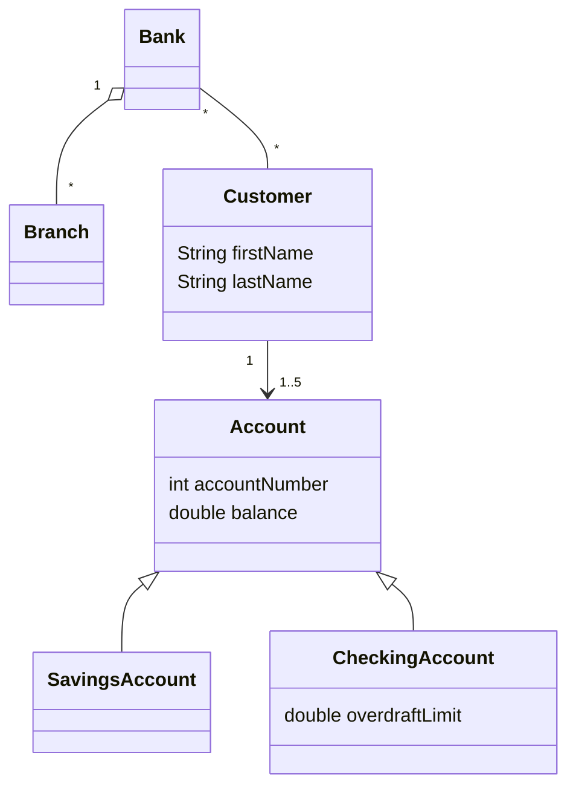

```mermaid
classDiagram
    class Bank

    class Branch

    class Customer {
        String firstName
        String lastName
    }

    class Account {
        int accountNumber
        double balance
    }

    class SavingsAccount

    class CheckingAccount {
        double overdraftLimit
    }

    Bank "1" o-- "*" Branch
    Bank "*" -- "*" Customer
    Customer "1" --> "1..5" Account
    Account <|-- SavingsAccount
    Account <|-- CheckingAccount
```
