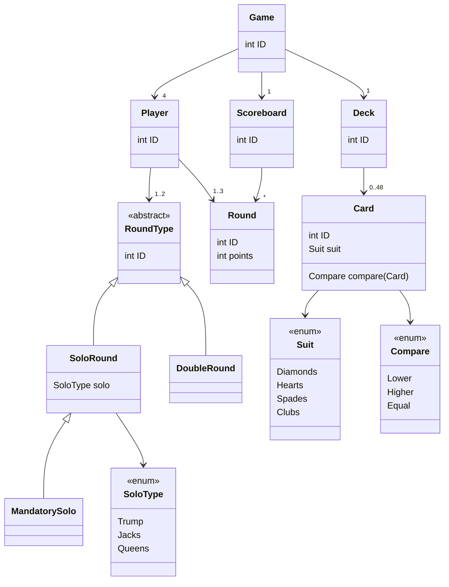

```mermaid
classDiagram

class Game {
  int ID
}

class Player {
  int ID
}

class Deck {
  int ID
}

class Card {
  int ID
  Suit suit
  Compare compare(Card)
}

class Scoreboard {
  int ID
}

class Round {
  int ID
  int points
}

class RoundType {
  <<abstract>>
  int ID
}

class SoloRound {
  SoloType solo
}

class MandatorySolo

class DoubleRound 

class Suit {
  <<enum>>
  Diamonds
  Hearts
  Spades
  Clubs
}

class Compare {
  <<enum>>
  Lower
  Higher
  Equal
}

class SoloType {
  <<enum>>
  Trump
  Jacks
  Queens
}

Game --> "1" Scoreboard
Game --> "1" Deck
Game --> "4" Player

Deck --> "0..48" Card

Scoreboard --> "*" Round

Player --> "1..3" Round
Player --> "1..2" RoundType

RoundType <|-- SoloRound
RoundType <|-- DoubleRound
SoloRound <|-- MandatorySolo

Card --> Suit
Card --> Compare
SoloRound --> SoloType
```
