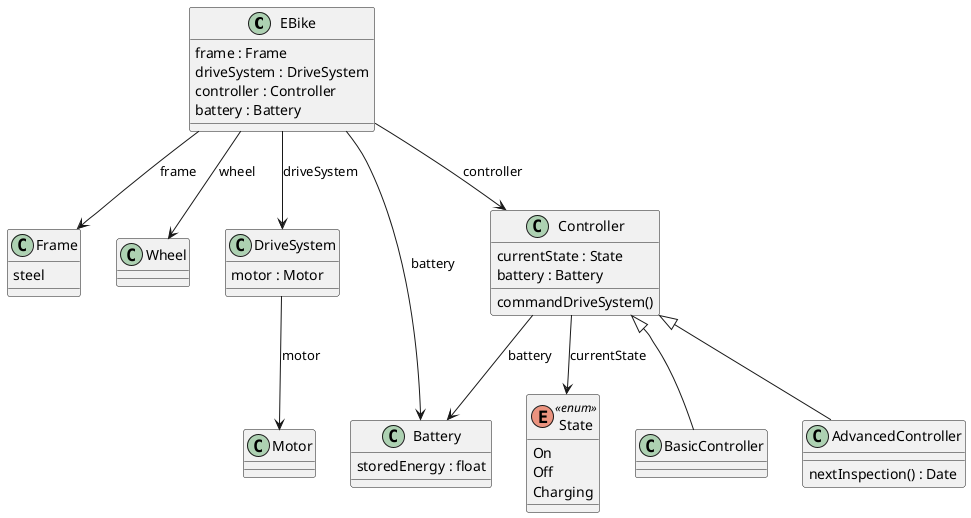

```plantuml

@startuml

    class EBike {
        frame : Frame
        driveSystem : DriveSystem
        controller : Controller
        battery : Battery
    }

    class Frame {
        steel
    }

    class Wheel

    class DriveSystem {
        motor : Motor
    }

    class Motor

    class Controller {
        currentState : State
        battery : Battery
        commandDriveSystem()
    }

    class BasicController

    class AdvancedController {
        nextInspection() : Date
    }

    class Battery {
        storedEnergy : float
    }

    enum State <<enum>> {
        On
        Off
        Charging
    }

    EBike --> Wheel : wheel
    EBike --> Battery : battery
    EBike --> Frame : frame
    EBike --> DriveSystem : driveSystem
    EBike --> Controller : controller

    DriveSystem --> Motor : motor

    Controller --> Battery : battery
    Controller --> State : currentState
    Controller <|-- BasicController
    Controller <|-- AdvancedController

@enduml

```
