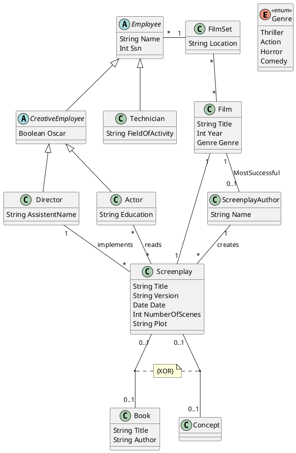

```plantuml
@startuml

enum Genre <<enum>> {
    Thriller
    Action
    Horror
    Comedy
}

abstract class Employee {
    String Name
    Int Ssn
}

abstract class CreativeEmployee {
    Boolean Oscar
}

class Technician {
    String FieldOfActivity
}

class Director {
    String AssistentName
}

class Actor {
    String Education
}

class Screenplay {
    String Title
    String Version
    Date Date
    Int NumberOfScenes
    String Plot
}

class FilmSet {
    String Location
}

class Film {
    String Title
    Int Year
    Genre Genre
}

class ScreenplayAuthor {
    String Name
}

class Book {
    String Title
    String Author
}

class Concept {}

Employee <|-- CreativeEmployee
Employee <|-- Technician
CreativeEmployee <|-- Director
CreativeEmployee <|-- Actor
Director "1"--"*" Screenplay : implements
Actor "*"--"*" Screenplay : reads
Employee "*"-"1" FilmSet
FilmSet "*"--"*" Film
Film "1"--"0..1" ScreenplayAuthor : MostSuccessful
ScreenplayAuthor "1"--"*" Screenplay : creates
Film "1"--"1" Screenplay
Screenplay "0..1"--"0..1" Book
Screenplay "0..1"--"0..1" Concept

note "{XOR}" as N1
(Book,Screenplay)..N1
N1..(Screenplay,Concept)

@enduml
```