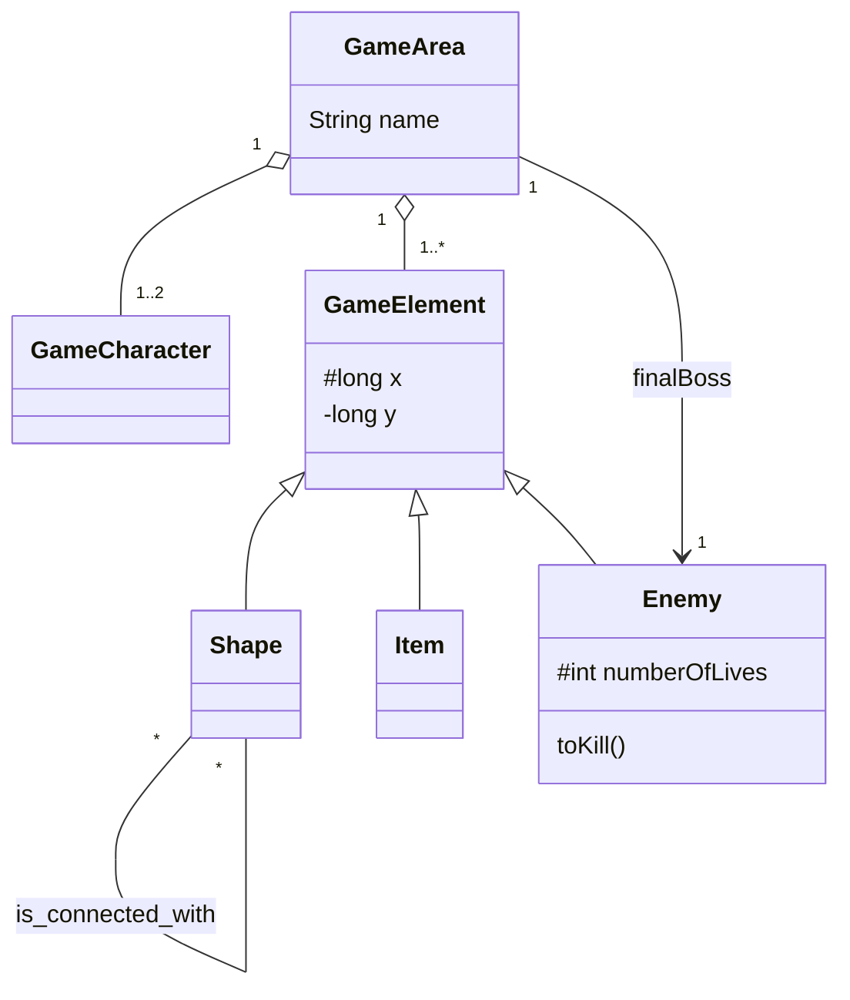

```mermaid
classDiagram
    class GameArea {
        String name
    }

    class GameCharacter

    class GameElement {
        #long x
        -long y
    }

    class Shape

    class Item

    class Enemy {
        #int numberOfLives
        toKill()
    }

    GameArea "1" o-- "1..2" GameCharacter
    GameArea "1" o-- "1..*" GameElement
    GameElement <|-- Shape
    GameElement <|-- Item
    GameElement <|-- Enemy

    Shape "*" -- "*" Shape : is_connected_with

    GameArea "1" --> "1" Enemy : finalBoss

```
