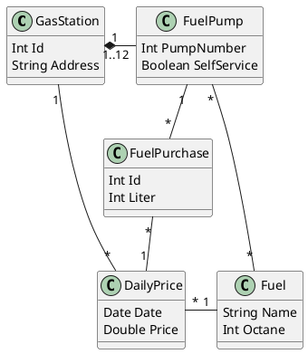

```plantuml
@startuml

class GasStation {
    Int Id
    String Address
}

class DailyPrice {
    Date Date
    Double Price
}

class FuelPurchase {
    Int Id
    Int Liter
}

class FuelPump {
    Int PumpNumber
    Boolean SelfService
}

class Fuel {
    String Name
    Int Octane
}


GasStation "1"--"*" DailyPrice
GasStation "1"*-"1..12" FuelPump
DailyPrice "*"-"1" Fuel
FuelPump "1"--"*" FuelPurchase
FuelPurchase "*"--"1" DailyPrice
FuelPump "*"--"*" Fuel


@enduml
```