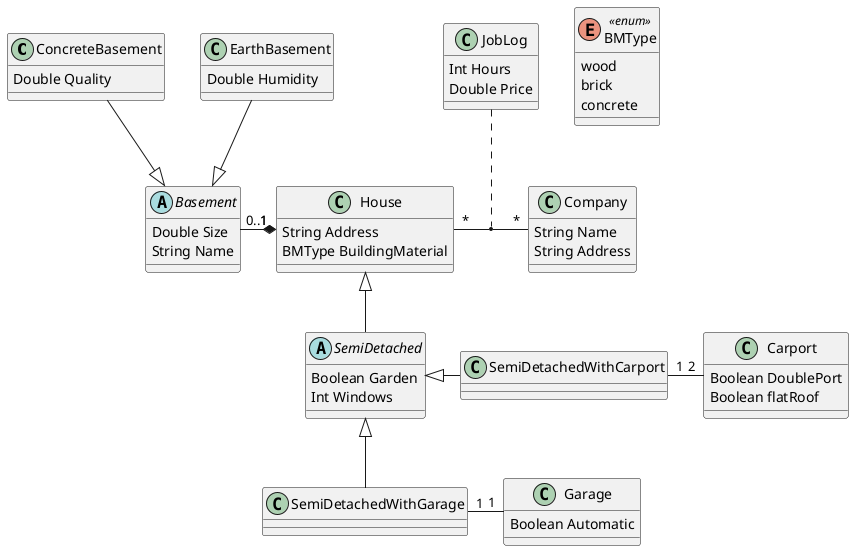

```plantuml
@startuml

class ConcreteBasement {
    Double Quality
}

abstract class Basement {
    Double Size
    String Name
}

enum BMType <<enum>> {
    wood
    brick
    concrete
}

class EarthBasement {
    Double Humidity
}

abstract class SemiDetached {
    Boolean Garden
    Int Windows
}

class House {
    String Address
    BMType BuildingMaterial
}

class JobLog {
    Int Hours
    Double Price
}

class SemiDetachedWithCarport {}

class SemiDetachedWithGarage {}

class Company {
    String Name
    String Address
}

class Carport {
    Boolean DoublePort
    Boolean flatRoof
}

class Garage {
    Boolean Automatic
}


ConcreteBasement --|> Basement
EarthBasement --|> Basement
Basement "0..1" -* "1" House
House "*"-"*" Company
JobLog .. (House,Company)
House <|-- SemiDetached
SemiDetached <|- SemiDetachedWithCarport
SemiDetached <|-- SemiDetachedWithGarage
SemiDetachedWithCarport "1"-"2" Carport
SemiDetachedWithGarage "1"-"1" Garage

@enduml
```