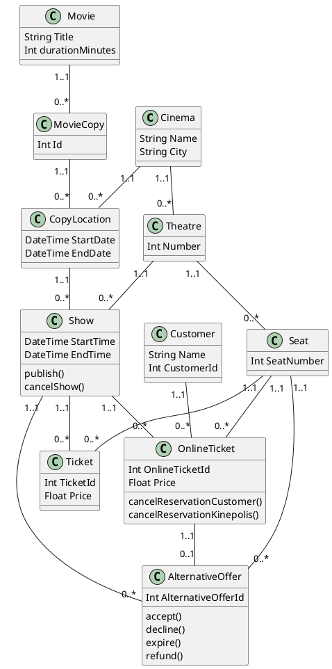

```plantuml
@startuml

    class Cinema {
	    String Name
	    String City
    }
    class Theatre {
	    Int Number
    }
    class Movie {
	    String Title
	    Int durationMinutes
    }
    class MovieCopy {
	    Int Id
    }
    class CopyLocation {
	    DateTime StartDate
	    DateTime EndDate
    }
    class Seat {
	    Int SeatNumber
    }
    class Show {
	    DateTime StartTime
	    DateTime EndTime
      publish()
      cancelShow()
    }
    class Ticket {
      Int TicketId
      Float Price
    }
    class Customer {
      String Name
      Int CustomerId
    }
    class OnlineTicket {
      Int OnlineTicketId
      Float Price
      cancelReservationCustomer()
      cancelReservationKinepolis()
    }
    class AlternativeOffer {
      Int AlternativeOfferId
      accept()
      decline()
      expire()
      refund()
    }


    Cinema "1..1" -- "0..*" Theatre
    Movie "1..1" -- "0..*" MovieCopy
    Cinema "1..1" -- "0..*" CopyLocation
    MovieCopy "1..1" -- "0..*" CopyLocation
    Theatre "1..1" -- "0..*" Seat
    Theatre "1..1" -- "0..*" Show
    CopyLocation "1..1" -- "0..*" Show
    Seat "1..1" -- "0..*" Ticket
    Show "1..1" -- "0..*" Ticket
    Customer "1..1" -- "0..*" OnlineTicket
    Seat "1..1" -- "0..*" OnlineTicket
    Show "1..1" -- "0..*" OnlineTicket
    OnlineTicket "1..1" -- "0..1" AlternativeOffer
    Seat "1..1" -- "0..*" AlternativeOffer
    Show "1..1" -- "0..*" AlternativeOffer

@enduml
```
