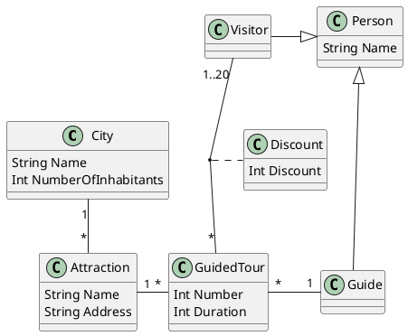

```plantuml
@startuml

class City {
    String Name
    Int NumberOfInhabitants
}

class Attraction {
    String Name
    String Address
}

class Visitor {}

class GuidedTour {
    Int Number
    Int Duration
}

class Discount {
    Int Discount
}

class Person {
    String Name
}

class Guide {}


City "1"--"*" Attraction
Visitor "1..20"--"*" GuidedTour
Attraction "1"-"*" GuidedTour
Person <|-- Guide
Visitor -|> Person
GuidedTour "*"-"1" Guide
(Visitor,GuidedTour) .. Discount

@enduml
```