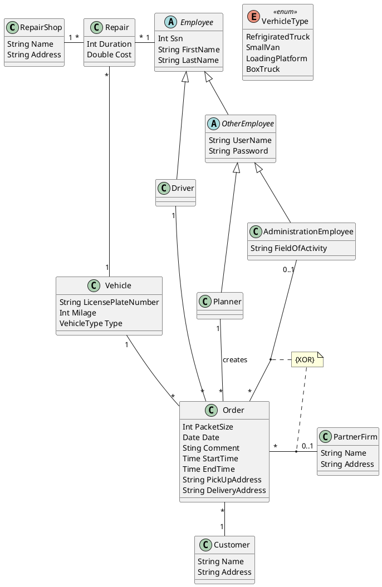

```plantuml
@startuml

class RepairShop {
    String Name
    String Address
}

class Repair {
    Int Duration
    Double Cost
}

class Vehicle {
    String LicensePlateNumber
    Int Milage
    VehicleType Type
}

class Order {
    Int PacketSize
    Date Date
    Sting Comment
    Time StartTime
    Time EndTime
    String PickUpAddress
    String DeliveryAddress
}

abstract class Employee {
    Int Ssn
    String FirstName
    String LastName
}

class Driver {}

abstract class OtherEmployee {
    String UserName
    String Password
}

class Planner {}

class AdministrationEmployee {
    String FieldOfActivity
}

class PartnerFirm {
    String Name
    String Address
}

class Customer {
    String Name
    String Address
}

enum VerhicleType <<enum>> {
    RefrigiratedTruck
    SmallVan
    LoadingPlatform
    BoxTruck
}

RepairShop "1"-"*" Repair
Repair "*"--"1" Vehicle
Repair "*"-"1" Employee
Vehicle "1"--"*" Order
Employee <|-- Driver
Driver "1"--"*" Order
Employee <|-- OtherEmployee
OtherEmployee <|-- Planner
OtherEmployee <|-- AdministrationEmployee
Planner "1" --"*" Order : creates
AdministrationEmployee "0..1"--"*" Order
Order "*"-"0..1" PartnerFirm
Order "*"--"1" Customer

note "{XOR}" as N1
(Order,AdministrationEmployee)..N1
N1..(Order,PartnerFirm)

@enduml
```