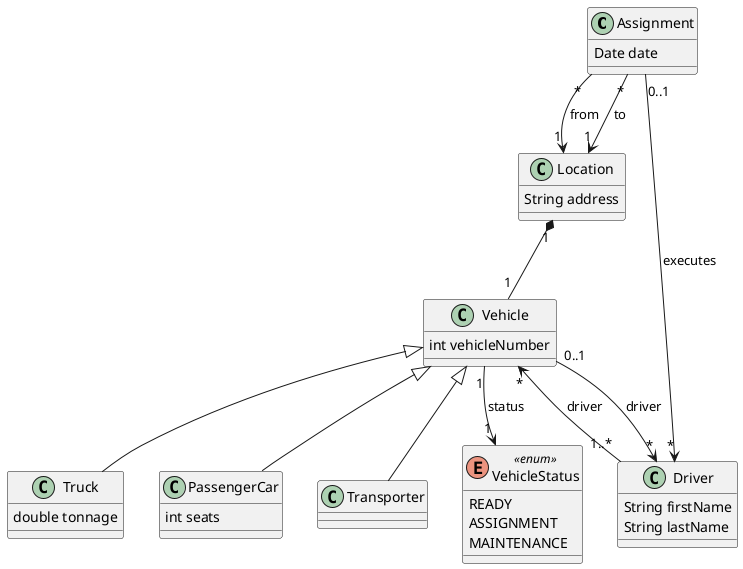

```plantuml

@startuml

    class Assignment {
        Date date
    }

    class Location {
        String address
    }

    class Driver {
        String firstName
        String lastName
    }

    class Vehicle {
        int vehicleNumber
    }

    class Truck {
        double tonnage
    }

    class PassengerCar {
        int seats
    }

    class Transporter

    enum VehicleStatus <<enum>> {
        READY
        ASSIGNMENT
        MAINTENANCE
    }

    Assignment "0..1" --> "*" Driver : executes
    Assignment "*" --> "1" Location : from
    Assignment "*" --> "1" Location : to
    Location "1" *-- "1" Vehicle

    Driver "1..*" --> "*" Vehicle : driver
    Vehicle "0..1" --> "*" Driver : driver

    Vehicle <|-- Truck
    Vehicle <|-- PassengerCar
    Vehicle <|-- Transporter

    Vehicle "1" --> "1" VehicleStatus : status

@enduml

```
