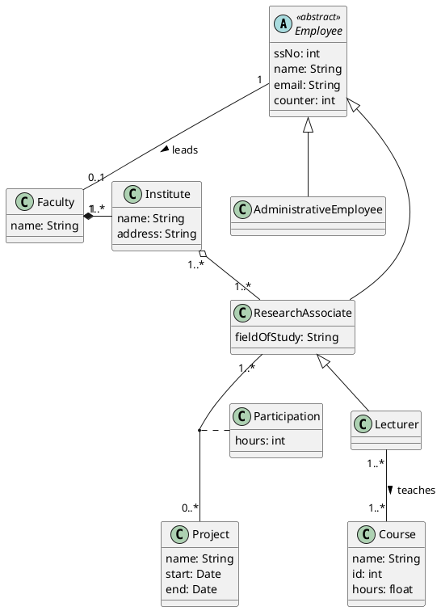

```plantuml

@startuml


abstract Employee <<abstract>> {
  ssNo: int
  name: String
  email: String
  counter: int
}

class Faculty {
  name: String
}

class AdministrativeEmployee

class ResearchAssociate {
  fieldOfStudy: String
}

class Institute {
  name: String
  address: String
}

class Course {
  name: String
  id: int
  hours: float
}

class Lecturer

class Project {
  name: String
  start: Date
  end: Date
}

class Participation {
  hours: int
}

Employee "1" -- "0..1" Faculty : leads >
Employee <|-- AdministrativeEmployee
Employee <|-- ResearchAssociate
Faculty "1" *- "1..*" Institute
Institute "1..*" o-- "1..*" ResearchAssociate
ResearchAssociate <|-- Lecturer
ResearchAssociate "1..*" -- "0..*" Project
Lecturer "1..*" -- "1..*" Course : teaches >
(ResearchAssociate, Project) .. Participation

@enduml

```
