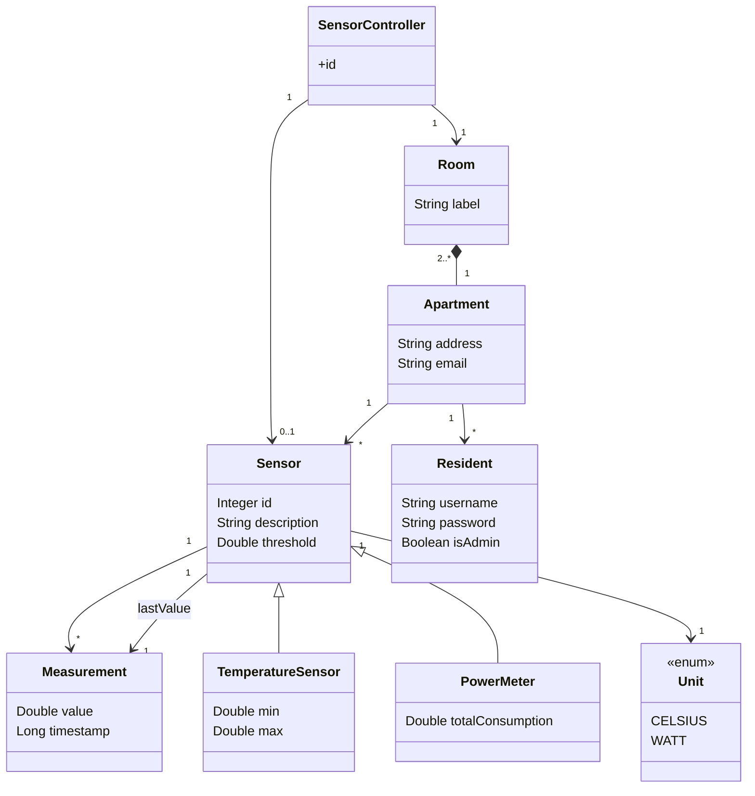

```mermaid
classDiagram
    class SensorController {
        +id
    }

    class Sensor {
        Integer id
        String description
        Double threshold
    }

    class Measurement {
        Double value
        Long timestamp
    }

    class TemperatureSensor {
        Double min
        Double max
    }

    class PowerMeter {
        Double totalConsumption
    }

    class Unit {
        <<enum>>
        CELSIUS
        WATT
    }

    class Room {
        String label
    }

    class Apartment {
        String address
        String email
    }

    class Resident {
        String username
        String password
        Boolean isAdmin
    }

    SensorController "1" --> "0..1" Sensor
    Sensor "1" --> "*" Measurement
    Sensor "1" --> "1" Measurement : lastValue
    Sensor <|-- TemperatureSensor
    Sensor <|-- PowerMeter
    Sensor "1" --> "1" Unit
    SensorController "1" --> "1" Room
    Room "2..*" *-- "1" Apartment
    Apartment "1" --> "*" Resident
    Apartment "1" --> "*" Sensor

```
